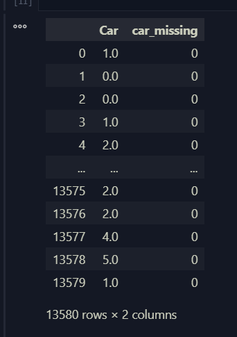

# 🛠️ Strategi Handle Missing Value

## 1. Strategi 1: Hapus (Drop)

- `df.dropna()` — hapus baris yang mengandung NaN.
- `df.dropna(subset=["kolom"])` — hanya jika NaN di kolom tertentu.
- `df.dropna(axis=1, thresh=n)` — hapus kolom yang non-null-nya kurang dari n.

Kapan drop masuk akal: missing-nya sedikit (< 5%) dan MCAR, atau satu kolom bolong parah (> 60-70%) sehingga tidak layak diselamatkan. Hati-hati: drop baris berlebihan = buang informasi + potensi bias.


**Code:**
```python
df_clean = df_new.copy()
print("Sebelum:", df_clean.shape)
print("Kalau dropna semua:", df_clean.dropna().shape)  # kehilangan banyak baris!
print("Drop hanya berdasarkan kolom data:", df_clean.dropna(subset=["BuildingArea"]).shape)
```

**Output:**
```bash
Sebelum: (13580, 21)
Kalau dropna semua: (6196, 21)
Drop hanya berdasarkan kolom data: (7130, 21)
```

---

## 2. Strategi 2: Imputasi Sederhana

- **Numerik**: isi dengan `median` (tahan outlier) atau `mean` (kalau distribusi normal).
- **Kategorikal**: isi dengan `mode` (nilai terbanyak) atau kategori baru `"Unknown"`.
- **Time series**: `ffill()` (isi dari nilai sebelumnya) / `bfill()`.

Untuk ML: hitung nilai imputasi dari **train set** saja, lalu terapkan ke test set — mencegah data leakage.

**Code:**
```python
df_imp = df_new.copy()

# Numerik -> median
df_imp["Car"] = df_imp["Car"].fillna(df_imp["Car"].median())
df_imp["BuildingArea"] = df_imp["BuildingArea"].fillna(df_imp["BuildingArea"].median())

# Kategorikal -> mode
df_imp["CouncilArea"] = df_imp["CouncilArea"].fillna(df_imp["CouncilArea"].mode()[0])

# Rating -> mean dibulatkan
df_imp["YearBuilt"] = df_imp["YearBuilt"].fillna(df_imp["YearBuilt"].mean().round())

print(df_imp.isnull().sum())
df_imp
```
**Output:**
```bash
Suburb           0
Address          0
Rooms            0
Type             0
Price            0
Method           0
SellerG          0
Date             0
Distance         0
Postcode         0
Bedroom2         0
Bathroom         0
Car              0
Landsize         0
BuildingArea     0
YearBuilt        0
CouncilArea      0
Lattitude        0
Longtitude       0
Regionname       0
Propertycount    0
dtype: int64
```


---
### 2.1 🤔 Kenapa median dianggap tahan terhadap outlier?
---

Karena median hanya melihat **posisi data**, bukan besarnya nilai.

**Contoh:**

**Data normal:**
```sql
10, 12, 13, 14, 15
```
**Mean:**
```python
(10+12+13+14+15)/5 = 12.8
```

**Median:**
```python
13
```

**Sekarang tambahkan outlier:**
```sql
10, 12, 13, 14, 1000
```

**Mean:**
```python
(10+12+13+14+1000)/5 = 209.8
```

**Median:**
```python
13
```

**Perhatikan:**
| Statistik | Sebelum | Sesudah Outlier |
| --------- | ------- | --------------- |
| Mean      | 12.8    | 209.8           |
| Median    | 13      | 13              |

`Mean` berubah sangat jauh. Sedangkan
`Median` tidak berubah sama sekali.

Karena `Median` hanya mengambil nilai tengah setelah data diurutkan.

Tetapi juga banyak orang menyimpulkan:
> "Median selalu lebih baik daripada mean."

Tidak selalu.

Jika datanya memang normal dan tidak ada outlier, median justru membuang sebagian informasi numerik yang dimiliki mean.

---
### 2.2 📊🤔 Kenapa mean cocok untuk distribusi normal?
---

Karena pada distribusi normal:

- data simetris
- mean ≈ median ≈ mode

**Visualnya:**
```bash
          /\
        /    \
      /        \
----|----|----|----
   mean median mode
```
Karena distribusi seimbang kiri-kanan, mean menjadi representasi pusat data yang baik.

**Misal:**
```sql
95, 98, 100, 102, 105
```

**Mean:**
```python
100
```

**Median:**
```python
100
```
Hasilnya hampir sama.

Dalam kondisi seperti ini:

- mean menggunakan seluruh informasi data
- estimasi statistik biasanya lebih efisien

Karena itu mean sering dipilih.

---
### Cara berpikirnya

#### Gunakan:

##### Mean
- distribusi cukup simetris
- tidak banyak outlier

##### Median
- distribusi miring (skewed)
- banyak outlier

#### Contoh:

##### Pendapatan manusia:
```sql
3 jt
4 jt
4 jt
5 jt
100 jt
```
##### Mean:
```bash
23.2 jt
```

##### Median:
```python
4 jt
```
Mana yang lebih menggambarkan "orang biasa"?

Median.

---
### 2.3 ⏰📅🤔 Kenapa time series sering memakai ffill() atau bfill()?
---

Karena ada asumsi bahwa nilai pada waktu yang berdekatan saling berhubungan.

**Misal:**

| **Jam**   | **Suhu** |
| ----- | ---- |
| 10:00 | 30   |
| 11:00 | ?    |
| 12:00 | 31   |

Kita tahu suhu tidak biasanya berubah drastis dalam 1 jam.

**Maka:**

#### Forward Fill
```python
ffill()
```

menjadi:
| **Jam**   | **Suhu** |
| ----- | ---- |
| 10:00 | 30   |
| 11:00 | 30   |
| 12:00 | 31   |

Menggunakan nilai sebelumnya.

----

#### Backward Fill
```python
bfill()
```
menjadi:
| **Jam**   | **Suhu** |
| ----- | ---- |
| 10:00 | 30   |
| 11:00 | 31   |
| 12:00 | 31   |

Menggunakan nilai sesudahnya.

---
### 2.4 ⚠️ Apakah harus ada tanggal/jam yang hilang?
---
Tidak.

Ada dua kasus berbeda:

#### Kasus A: Timestamp ada, nilainya hilang
| **Tanggal** | **Penjualan** |
| ------- | --------- |
| 1 Jan   | 100       |
| 2 Jan   | NaN       |
| 3 Jan   | 105       |

Yang hilang adalah nilainya.

#### Kasus B: Timestamp hilang
| **Tanggal** | **Penjualan** |
| ------- | --------- |
| 1 Jan   | 100       |
| 3 Jan   | 105       |

Tanggal 2 Jan tidak ada.

**Biasanya kita perlu:**

```python
resample()
```
atau
```python
reindex()
```
untuk membuat tanggal yang hilang terlebih dahulu.

**Baru setelah itu bisa:**

```python
ffill()
```
atau
```python
bfill()
```

**Banyak pemula menganggap:**

> "ffill selalu aman"

Belum tentu.

#### Contoh:

Harga saham.

```bash
09:00 = 100
16:00 = 130
```

Mengisi semua jam kosong dengan 100 bisa menghasilkan distorsi.

**Kadang lebih cocok:**

- interpolation
- moving average
- model-based imputation

daripada ffill.

---

### 2.5 🚨 Apa itu Data Leakage?


**Data Leakage(kebocoran data)** dalam machine learning terjadi ketika informasi dari data uji (test set) secara tidak sengaja "bocor" masuk ke dalam data latih (training set) saat proses pelatihan model.

Akibatnya:

- Evaluasi model menjadi tidak realistis.
- Akurasi terlihat lebih tinggi dari kondisi sebenarnya.
- Performa saat deployment sering turun drastis.

#### Ilustrasi

Yang salah:
```
TEST
↓
TRAINING
```

Padahal yang benar:
```
TRAINING
↓
MODEL
↓
TEST
```

Informasi mengalir ke arah yang salah sehingga model secara tidak sengaja "mencontek".

---

### 2.6 📌 Kenapa data leakage selalu berpusat di data uji(data test)?

Hal ini selalu berpusat pada data uji karena **data uji seharusnya menjadi ujian murni yang belum pernah dilihat atau disentuh sama sekali oleh model**. Ketika informasi dari data uji ikut tercampur di awal (seperti saat melakukan normalisasi, imputasi, atau ekstraksi fitur pada seluruh data sekaligus sebelum dibagi), model secara tidak sadar "menyontek" kunci jawaban dari ujian tersebut. Akibatnya, performa atau akurasi model terlihat sangat tinggi saat diuji, tetapi hancur atau gagal total ketika dihadapkan pada data dunia nyata yang benar-benar baru.


---

### 2.7 🔍 Apa ciri-ciri Data Leakage?

---

#### 1. Akurasi test terlalu tinggi

Contoh:
```
Train = 85%
Test = 99%
```

Hasil seperti ini patut dicurigai karena jarang terjadi pada data nyata.

---

#### 2. Performa deployment jauh lebih buruk

Contoh:
```
Validation = 98%
Production = 70%
```

Sering kali terdapat data leakage yang membuat hasil evaluasi terlalu optimistis.

---

#### 3. Menggunakan informasi masa depan

Contoh:

Target:
```
Apakah pelanggan akan churn?
```

Tetapi fitur yang digunakan:
```
Tanggal pelanggan berhenti berlangganan
```

Model mendapatkan informasi yang seharusnya belum diketahui saat prediksi dilakukan.

---

### 2.8 🛡️ Cara Mencegah Data Leakage

---

#### 1. Lakukan Train-Test Split Terlebih Dahulu

Jangan melakukan preprocessing pada seluruh data sebelum split.

❌ Salah

```python
df.fillna(df.median())
train_test_split(...)
```

✅ Benar

```python
train_test_split(...)

median = X_train.median()

X_train.fillna(median)
X_test.fillna(median)
```

---

#### 2. Fit Scaler Hanya Pada Train Set

❌ Salah

```python
scaler.fit(df)
```

✅ Benar

```python
scaler.fit(X_train)

scaler.transform(X_train)
scaler.transform(X_test)
```

---

#### 3. Fit Encoder Hanya Pada Train Set

❌ Salah

```python
encoder.fit(all_data)
```

✅ Benar

```python
encoder.fit(X_train)
encoder.fit_transform(X_train)
encoder.transform(X_test)
```

---

#### 4. Hindari Feature yang Mengandung Informasi Masa Depan

Contoh:

```
Prediksi penjualan Januari.
```

Tetapi feature berisi:

```
Total penjualan Februari
```

Ini termasuk data leakage karena model memperoleh informasi yang belum tersedia saat prediksi dilakukan.

---

#### 5. Gunakan Pipeline

Pada Scikit-Learn, Pipeline membantu memastikan:

- Imputasi
- Scaling
- Encoding

hanya di-fit menggunakan train set.

Alur yang benar:

```
Train
 ├─ Fit Imputer
 ├─ Fit Scaler
 ├─ Fit Encoder
 ├─ Train Model
 │
Test
 ├─ Transform dengan parameter train
 └─ Evaluasi
```

Pipeline merupakan salah satu cara paling aman untuk mengurangi risiko data leakage.

---

## 3. Strategi 3: Missing Indicator

Kadang **fakta bahwa data hilang itu sendiri informatif** (terutama MNAR). Solusinya: tambah kolom penanda sebelum imputasi, supaya model tetap tahu baris mana yang aslinya kosong.


**Code:**
```python
df_ind = df_new.copy()
df_ind["car_missing"] = df_ind["Car"].isnull().astype(int)
df_ind["Car"] = df_ind["Car"].fillna(df_ind["Car"].median())
df_ind[["Car", "car_missing"]]
```

**Output:**



---

## 4. Strategi Lanjutan (untuk ML)

- `SimpleImputer` (scikit-learn) — imputasi dalam pipeline, aman dari leakage.
- `KNNImputer` — isi berdasarkan baris-baris yang mirip.
- `IterativeImputer` — prediksi nilai hilang dari kolom lain.

---

# 📌 Rule of Thumb

| Kondisi | Aksi |
|---------|------|
| Missing < 5%, MCAR | Drop baris atau imputasi sederhana |
| Missing 5-30% | Imputasi (median/mode) + pertimbangkan indicator |
| Missing 30-60% | Imputasi hati-hati + indicator, evaluasi kegunaan kolom |
| Missing > 60-70% | Pertimbangkan drop kolom |

