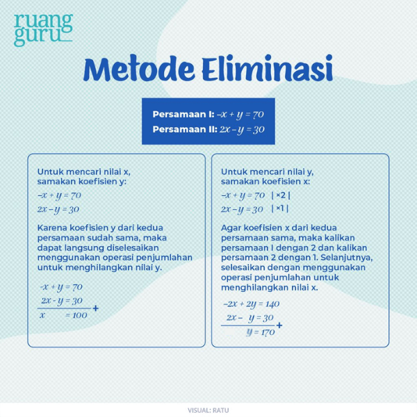
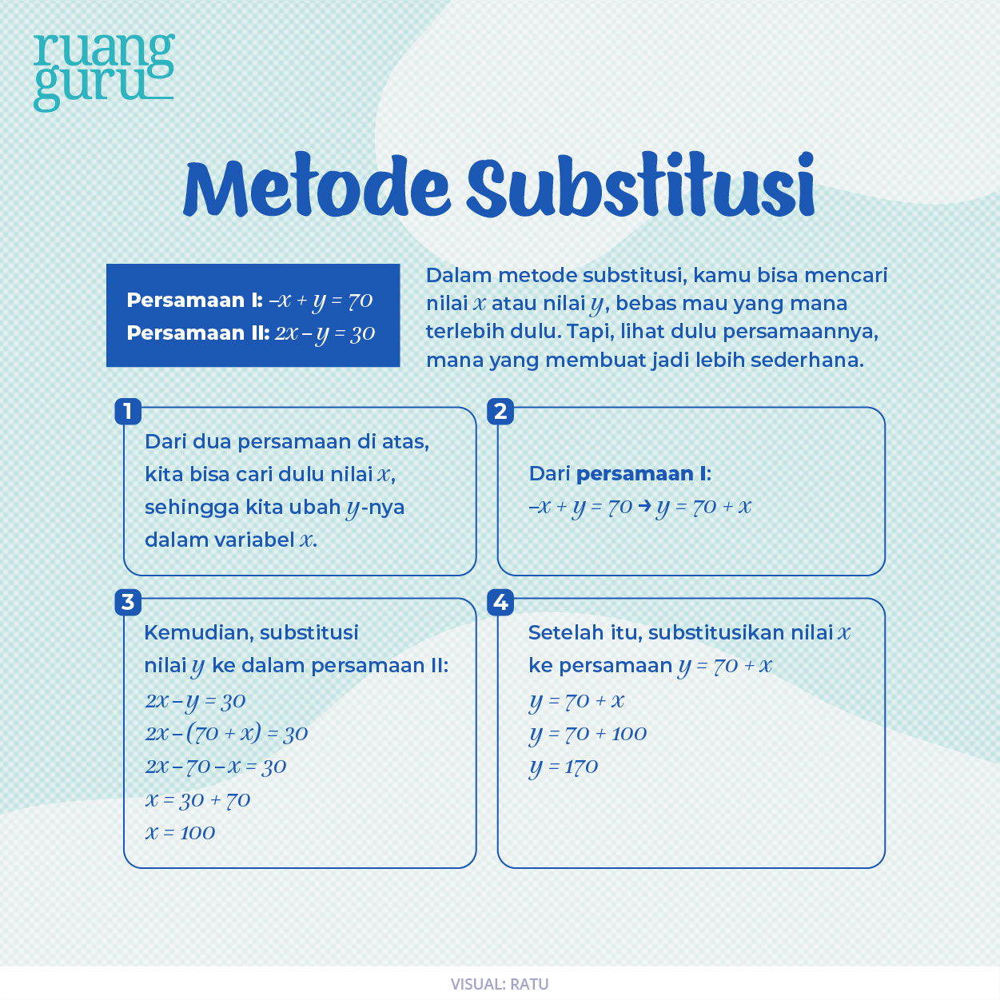

# 🧮 Sistem Persamaan Linear Dua Variabel (SPLDV)

## 📖 Apa Itu SPLDV?

SPLDV (Sistem Persamaan Linear Dua Variabel) adalah kumpulan dua persamaan linear yang memiliki dua variabel (biasanya x dan y) dan dicari nilai yang memenuhi kedua persamaan tersebut sekaligus.

Contoh:

$$
-x + y = 70
$$

$$
2x - y = 30
$$

Tujuan kita adalah mencari nilai:

$$
x = ?
$$

$$
y = ?
$$

---

# 🔥 Metode 1: Eliminasi

## 🎯 Tujuan

Menghilangkan salah satu variabel dengan membuat koefisiennya sama besar sehingga variabel tersebut menjadi **0** setelah dijumlahkan atau dikurangkan.

---

## 📌 Prinsip Utama

Metode eliminasi **bukan tentang positif atau negatif**, melainkan:

> Membuat koefisien variabel yang ingin dihilangkan menjadi sama besar.

Setelah sama besar:

- Jika tandanya **berlawanan** → **jumlahkan**
- Jika tandanya **sama** → **kurangkan**

---

## 🧩 Langkah-Langkah Eliminasi

### 1️⃣ Pilih variabel yang ingin dihilangkan

Contoh:

$$
-x+y=70
$$

$$
2x-y=30
$$

Misal ingin menghilangkan **x**.

---

### 2️⃣ Perhatikan koefisien variabel tersebut

Koefisien x:

- Persamaan 1 = **-1**
- Persamaan 2 = **2**

---

### 3️⃣ Samakan besar koefisien

Cari KPK dari:

$$
1 \text{ dan } 2
$$

KPK = **2**

Maka koefisien x diubah menjadi:

$$
-2 \text{ dan } 2
$$

---

### 4️⃣ Tentukan pengali

Agar menjadi -2 dan 2:

- Persamaan 1 dikali **2**
- Persamaan 2 dikali **1**

$$
(-x+y=70)\times2
$$

$$
(2x-y=30)\times1
$$

Hasil:

$$
-2x+2y=140
$$

$$
2x-y=30
$$

---

### 5️⃣ Hilangkan variabel

Karena koefisien x:

$$
-2 \text{ dan } 2
$$

tandanya berlawanan.

Maka **jumlahkan**:

$$
(-2x+2y)+(2x-y)
$$

$$
y=170
$$

---

## 📌 Mengapa Dikali 2 dan 1?

Karena ingin membuat:

$$
-1 \rightarrow -2
$$

$$
2 \rightarrow 2
$$

Sehingga menjadi:

$$
-2x+2x=0
$$

Jadi angka pengali berasal dari kebutuhan untuk menyamakan koefisien.

---

## 🔍 Aturan Cepat Eliminasi

| Kondisi Koefisien | Operasi |
|----------|----------|
| -a dan a | Dijumlahkan |
| a dan a | Dikurangkan |
| -a dan -a | Dikurangkan |

---

## 🧠 Cara Berpikir yang Benar

Jangan berpikir:

> "Kalau negatif harus dikali sekian."

Tetapi berpikirlah:

> "Koefisien variabel yang ingin dihilangkan harus dibuat sama besar."

Lalu tanyakan:

1. Berapa KPK koefisiennya?
2. Persamaan pertama harus dikali berapa?
3. Persamaan kedua harus dikali berapa?
4. Setelah sama besar, apakah dijumlahkan atau dikurangkan?

---

## 📋 Ringkasan Eliminasi

✅ Pilih variabel yang ingin dihilangkan.

✅ Cari koefisiennya.

✅ Cari KPK koefisien.

✅ Kalikan masing-masing persamaan agar koefisien sama besar.

✅ Jika tanda berlawanan → jumlahkan.

✅ Jika tanda sama → kurangkan.

✅ Variabel hilang dan persamaan menjadi lebih sederhana.

---

# 🔥 Metode 2: Substitusi

## 🎯 Tujuan

Mengganti (mensubstitusi) suatu variabel dengan bentuk yang ekuivalen dari persamaan lain.

Sederhananya:

> Cari salah satu variabel terlebih dahulu, lalu masukkan hasilnya ke persamaan yang lain.

---

## 📌 Prinsip Utama

Pada metode substitusi:

1. Pilih persamaan yang paling mudah diubah.
2. Nyatakan salah satu variabel dalam variabel lainnya.
3. Substitusikan ke persamaan yang lain.
4. Dapatkan nilai salah satu variabel.
5. Masukkan kembali untuk memperoleh variabel yang tersisa.

---

## 🧩 Langkah-Langkah Substitusi

Gunakan contoh:

$$
-x+y=70
$$

$$
2x-y=30
$$

---

### 1️⃣ Ubah salah satu persamaan

Dari Persamaan I:

$$
-x+y=70
$$

Pindahkan -x ke ruas kanan:

$$
y=70+x
$$

atau

$$
y=x+70
$$

Sekarang y sudah dinyatakan dalam bentuk x.

---

### 2️⃣ Substitusikan ke persamaan lain

Masukkan:

$$
y=x+70
$$

ke Persamaan II:

$$
2x-y=30
$$

menjadi:

$$
2x-(x+70)=30
$$

---

### 3️⃣ Selesaikan persamaan

Buka kurung:

$$
2x-x-70=30
$$

Gabungkan suku sejenis:

$$
x-70=30
$$

Tambahkan 70 ke kedua ruas:

$$
x=100
$$

---

### 4️⃣ Cari variabel yang belum diketahui

Substitusikan nilai x ke:

$$
y=x+70
$$

$$
y=100+70
$$

$$
y=170
$$

---

## 📌 Mengapa Memilih Persamaan I?

Karena:

$$
-x+y=70
$$

mudah diubah menjadi:

$$
y=x+70
$$

Tidak perlu pecahan atau pembagian.

---

## ⚡ Tips Memilih Persamaan untuk Substitusi

Pilih persamaan yang:

✅ Koefisiennya 1 atau -1

✅ Mudah dipindah ruas

✅ Tidak menghasilkan pecahan

Contoh yang mudah:

$$
x+y=10
$$

$$
3x-y=5
$$

Karena langsung bisa dibuat:

$$
y=10-x
$$

---

## ❌ Kesalahan Umum

### Salah membuka kurung

Misal:

$$
2x-(x+70)
$$

Bukan:

$$
2x-x+70
$$

Tetapi:

$$
2x-x-70
$$

Karena tanda minus di depan kurung harus dikalikan ke semua isi kurung.

---

### Salah memindahkan ruas

Misal:

$$
-x+y=70
$$

Menjadi:

$$
y=70+x
$$

Bukan:

$$
y=70-x
$$

---

## 🧠 Cara Berpikir yang Benar

Jangan berpikir:

> "Rumus substitusi apa ya?"

Tetapi berpikirlah:

> "Variabel mana yang paling mudah saya nyatakan dalam bentuk variabel lainnya?"

Jika sudah mendapat bentuk:

$$
x=f(y)
$$

atau

$$
y=f(x)
$$

maka tinggal menggantikannya ke persamaan lain.

---

## 📋 Ringkasan Substitusi

✅ Pilih persamaan yang paling mudah.

✅ Nyatakan x dalam y atau y dalam x.

✅ Substitusikan ke persamaan lainnya.

✅ Dapatkan satu variabel.

✅ Masukkan kembali untuk memperoleh variabel yang tersisa.

---

# ⚖️ Perbandingan Eliminasi vs Substitusi

| Metode | Ide Utama |
|----------|----------|
| Eliminasi | Menghilangkan variabel |
| Substitusi | Menggantikan variabel |
| Cocok Saat | Koefisien mudah disamakan |
| Cocok Saat | Ada persamaan yang mudah diubah menjadi x atau y |
| Hasil Akhir | Sama |
| Tujuan Akhir | Mencari nilai x dan y |

---

# 🎯 Kesimpulan

Metode Eliminasi:

> Membuat koefisien sama besar lalu menghilangkan variabel.

Metode Substitusi:

> Menyatakan satu variabel dalam variabel lain lalu menggantikannya ke persamaan lain.

Keduanya menghasilkan solusi yang sama, hanya cara berpikir dan langkah penyelesaiannya yang berbeda.